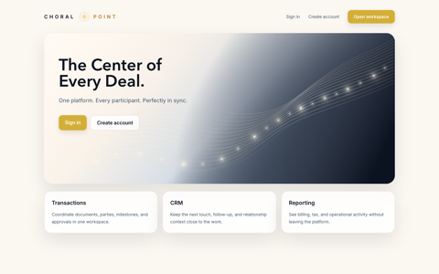

# Choral Point UI Progress

This log tracks incremental UI review changes during the `P32` polish sprint. Each entry records the narrow change, version, and a small page snapshot for quick visual reference.

## v4.32.2-dev - Landing hero navy field

- Extended the landing hero navy field into the lower-right corner to better match the lower-middle design-board reference.
- Kept the stronger corner treatment landing-page-specific so the login/public panel remains quieter.

## v4.32.3-dev - Organic wave artwork

- Replaced the evenly spaced wave paths with a denser, more varied strand set.
- Added irregular sparkles and softened glow clustering so the motif reads more like the approved flowing reference.

## v4.32.4-dev - Reference-close filament wave

- Increased the filament count and widened the ribbon so the landing hero tracks much closer to the approved board.
- Added layered glow clusters and more embedded sparkles to recreate the luminous, flowing reference treatment.

## v4.32.5-dev - B/C flow comparison artifact

- Added a standalone comparison page for the two leading navy-flow directions.
- Kept the decision artifact separate from the live landing page so the next applied design change remains deliberate.

[Open the B/C comparison page](./landing-flow-bc-comparison.html)

## v4.32.6-dev - Full-screen flow variants

- Split the two landing-flow candidates into separate full-screen HTML pages for honest side-by-side browser review.
- Preserved the combined comparison page as a compact reference board.

[Open option B](./landing-flow-b.html) | [Open option C](./landing-flow-c.html)

## v4.32.7-dev - Public marketing scaffold

- Adopted the approved full-screen landing/login treatment in-app.
- Added public-page scaffolds, login navigation, and the request-demo conversion path for later content refinement.

