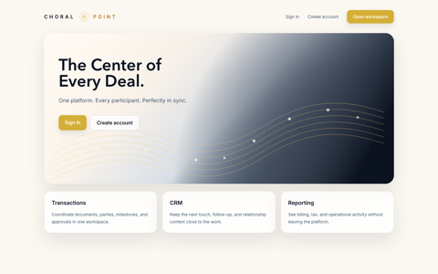

# Choral Point UI Progress

This log tracks incremental UI review changes during the `P32` polish sprint. Each entry records the narrow change, version, and a small page snapshot for quick visual reference.

## v4.32.2-dev - Landing hero navy field

- Extended the landing hero navy field into the lower-right corner to better match the lower-middle design-board reference.
- Kept the stronger corner treatment landing-page-specific so the login/public panel remains quieter.

